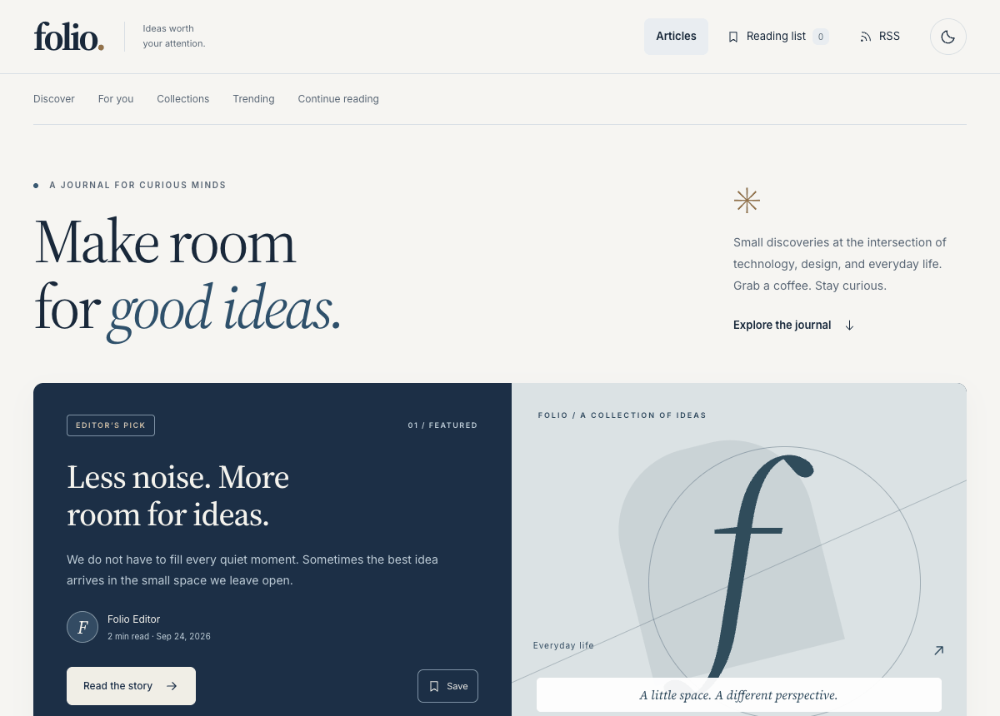

# Django Blog App

[](https://github.com/fatmakahveci/Django-Blog-App/commits/main)
[](https://www.python.org/)
[](https://www.djangoproject.com/)
[](LICENSE)

Folio is an English-language Django publication with an editorial interface,
scheduled posts, moderated discussions, and a personal reading experience.

## Demo



## Highlights

- Responsive article pages with persistent light/dark themes
- Editorial admin with drafts, scheduled publication, categories, and tags
- Search, sorting, pagination, featured articles, and author pages
- Moderated comments, saved reading lists, RSS, and search-engine discovery
- Security defaults, login throttling, and regression tests
- Guided local setup and permission-protected draft previews
- Discovery by reading length, weekly trending, followed topics, and curated collections
- Article reactions, reader polls, reading history/resume, focus controls, and read-aloud playback

See the [30-feature guide](docs/features.md) for every feature and its entry point.
The ten reader additions start at **http://127.0.0.1:8000/discover/**.

## Technology

- Python
- Django
- SQLite
- Django Templates

## Getting Started

### Prerequisites

- Python 3.12, 3.13, or 3.14
- pip

The project uses Django 6.1.1 and Django Axes, pinned in `requirements.txt`.

### Start locally

From the project directory, run:

```bash
python3 start.py
```

The launcher creates `.venv`, installs the pinned runtime dependencies, generates
a private `.env` when missing, checks configuration, and applies migrations.
On the first interactive launch it asks you to create an editor username and
password, then starts the app at **http://127.0.0.1:8000**. Existing settings,
accounts, and articles are kept. Later launches reuse installed dependencies.
Stop the server with **Ctrl+C**.

Useful options:

```bash
python3 start.py --demo                       # Add sample articles, collections, and a poll
python3 start.py --create-editor --setup-only # Create an editor without starting a server
python3 start.py --setup-only                 # Prepare the app without interactive prompts
python3 start.py --port 8001                  # Use another port if 8000 is occupied
```

Sample articles are optional and never overwrite existing content. The sample
author cannot sign in. Demo collections and a poll are included, with no fabricated
reactions or votes. Without an interactive terminal, setup prints the editor
creation command and never creates a default password.

The launcher is for local development and binds to `127.0.0.1`. It reads only
`DJANGO_SECRET_KEY`, `DJANGO_DEBUG`, and `DJANGO_ALLOWED_HOSTS` from `.env`, with
shell environment variables taking precedence. Values are literal; shell commands
and variable substitutions are not executed. Deployment settings are described below.

### Publish your first article

1. Select **Editor sign in** in the page footer, or open `/admin/` and sign in
   with the account you created.
2. Select **Write an article**. Add a title and body; the author defaults to
   your account. Categories, tags, excerpt, and slug are optional.
3. Keep the status **Draft**, select **Save and continue editing**, then
   **Preview saved article**. Preview shows saved changes in the reader layout
   and remains private to staff with article permissions.
4. Return to editing, choose **Published / scheduled**, set the publication time,
   and save. Past or current times publish immediately; future times schedule
   the article. All editorial dates use **UTC**.

Use **Review pending comments** on the editor dashboard to approve or hide
reader comments. To set your public byline, a superuser can edit your first and
last name under **Users**; email addresses are never displayed publicly.
Passwords can be changed from the editor's **Change password** link. Account
recovery is handled locally with `python manage.py changepassword USERNAME`
after loading the environment as shown below; email reset is not configured.

### Manual installation and management commands

The launcher handles setup above. If you prefer to manage the environment yourself:

```bash
python3 -m venv .venv
source .venv/bin/activate
python -m pip install -r requirements.txt
```

On first setup, create a private local environment file and generate a key:

```bash
cp .env.example .env
chmod 600 .env
python -c 'import secrets; print("DJANGO_SECRET_KEY=" + secrets.token_urlsafe(64))' >> .env
```

Keep an existing `.env` and its key when updating the project. For direct
`manage.py` commands, activate `.venv` and load the file in each new terminal.
Only `start.py` loads `.env` automatically:

```bash
set -a
source .env
set +a
python manage.py migrate
python manage.py runserver
```

Open http://127.0.0.1:8000.

To explore a populated publication, run `python manage.py seed_demo` after
migrating. It adds eight sample articles without overwriting existing content.
The sample author is inactive and has no usable password.

Create your own editor account with `python manage.py createsuperuser`, then
sign in at `/admin/` and follow the publishing steps above.
An active staff user also needs the relevant model permissions to edit content.

Post bodies are plain text with paragraph formatting; HTML is escaped.
Comments are pending until approved in the admin. Names and comments are public
after approval; commenter email addresses are not collected. A keyed IP digest
supports an atomic quota of three comments per ten-minute window; raw commenter IPs are not stored.

Readers can react and vote without accounts. A signed browser cookie keeps one
reaction per article and one vote per poll; these counts do not represent verified
unique people. Followed topics, reading history, and reading preferences stay in
browser storage. Read-aloud requires a browser with an installed local English voice.

To update an existing virtual environment after pulling dependency changes:

```bash
python -m pip install --upgrade -r requirements.txt
python -m pip check
python manage.py migrate
```

## Quality Checks

```bash
python -m pip install -r requirements-dev.txt
python manage.py check
python manage.py makemigrations --check --dry-run
python manage.py test
python -m pip_audit -r requirements-dev.txt
```

The suite covers first-run configuration, safe environment parsing, editor setup,
private draft previews, the save/preview/publish workflow, publication visibility across all public surfaces, search,
pagination, ordering, taxonomy, author privacy, comment moderation/spam controls,
editor permissions, RSS/sitemaps, and query counts. Administration coverage includes
login redirects, authentication, CSRF protection, secure cookies, throttling, and logout.
Security tests also cover startup validation, HTTPS redirects, response
headers, untrusted hosts, and forged forwarding headers. Authentication tests use Django's
isolated test database and do not change the local development database.
They use a fast password hasher scoped to the authentication test class;
application password hashing retains Django's defaults. Anonymous admin-access
tests disallow database queries; article pages use the isolated test database.

To run one group with detailed output:

```bash
python manage.py test blog.tests --verbosity 2
python manage.py test tests.test_admin --verbosity 2
python manage.py test tests.test_security --verbosity 2
```

CI runs the server suite on Python 3.12, 3.13, and 3.14, checks migration and
static-file consistency, and runs browser regression checks on a fresh demo database.

### Browser checks and demo recording

These optional tools use isolated browser storage and expect the eight original
sample articles from `seed_demo`. Run them against a local demo instance:

```bash
python -m pip install -r requirements-browser.txt
python -m playwright install chromium
python manage.py seed_demo
python manage.py runserver
```

In another terminal with the virtual environment active:

```bash
python scripts/browser_check.py
python scripts/record_demo.py
```

The browser check covers desktop/mobile layouts, keyboard search, saved articles,
theme persistence, sharing, print layout, and reading without JavaScript. It writes
screenshots to a temporary `folio-browser` directory. The recorder regenerates
`docs/assets/demo.gif` with five screens from the live app. Both commands accept
`--base-url` and `--output`. Set `CHROME_PATH` to use an existing Chrome executable
instead of Playwright's bundled Chromium.

The ten new reader features have a separate browser check:

```bash
python scripts/reader_check.py --base-url http://127.0.0.1:8001
```

Run it against a **disposable demo instance**, populated by `seed_demo`, on that
port. It submits a real reaction and poll vote in the test database. CI runs it
after the original browser checks on a fresh database. It verifies following,
collections, trending, voting, reading controls/history, responsive layouts,
and unavailable browser capabilities. Audio controls use a test voice in CI.

For implementation details and operational tradeoffs, see the
[quality guide](docs/quality.md).

## Security Configuration

The default configuration is for HTTPS deployment. Startup fails when the
secret key is missing or weak, or when the host list is empty or contains a
wildcard. Provide these values through your deployment's secret/environment manager:

| Variable | Local development | Deployment |
| --- | --- | --- |
| `DJANGO_SECRET_KEY` | Generated private key in `.env` | Independently generated private key, at least 50 characters |
| `DJANGO_DEBUG` | `true` | Unset or `false` |
| `DJANGO_ALLOWED_HOSTS` | Loopback hostnames | Comma-separated actual hostnames, without schemes or ports |

`.env` is excluded from version control. The former committed development key
has been removed; replace it in any existing deployment rather than retaining
it as a fallback. Key rotation invalidates existing signed sessions/tokens.

With debug disabled, the application redirects HTTP to HTTPS, marks session
and CSRF cookies as secure, and sends HSTS for one hour. TLS must be configured
on the application server or trusted reverse proxy. Forwarded protocol/host/IP
headers are not trusted by default. Behind a reverse proxy, configure trusted
TLS and client-IP handling only after ensuring that the proxy strips incoming
forwarded headers; otherwise HTTPS redirects may loop and clients may share an
IP-based login limit. See the [Django deployment checklist](https://docs.djangoproject.com/en/6.1/howto/deployment/checklist/).

HSTS subdomain coverage and browser preloading are deliberately disabled until
TLS coverage for the actual domain is known. Only their advisory checks
(`security.W005` and `security.W021`) are silenced; all other deployment
warnings remain active. Enable these policies only after validating the
deployment's domains and the preload requirements.

Run these commands with production environment variables configured:

```bash
python manage.py check --deploy --fail-level WARNING
python manage.py migrate
python manage.py collectstatic --noinput
```

Serve only `staticfiles/` as static content, never the repository root.

After five failed login attempts for the same account **or** IP address,
further attempts return HTTP 429 for a 15-minute cool-off period. Counters
are stored in the database and successful login resets matching failures.
An operator can clear an account lock with `python manage.py axes_reset_username USERNAME`
or an IP lock with `python manage.py axes_reset_ip IP_ADDRESS`. Both may need
resetting when both limits have been reached.

CI checks production settings and audits runtime and development dependencies.

Reader feedback has a shared quota of 30 reaction/vote requests per peer address
per ten-minute window, separate from the three-comment allowance. Windows start
with the first submission; HTTP 429 responses report when to retry. Quotas use
keyed address digests and atomic database updates, so clearing cookies, changing
forwarded headers, or sending concurrent requests does not bypass them. Readers
behind the same address share an allowance. Run migrations when updating to
install the quota table; expired entries are removed gradually as new clients arrive.

Categories and tags become public only when attached to a published article.
The [Content Security Policy](https://docs.djangoproject.com/en/6.1/ref/csp/)
allows scripts and form destinations only from this origin and blocks inline
scripts, plugins, framing, and base-URL overrides. Inline styles remain allowed
for editor widgets. Keep reverse-proxy request limits in place for broader
traffic protection.

## Repository Structure

```text
Django-Blog-App/
├── .github/            # CI workflows and contribution policies
├── blog/               # Blog application, migrations, and tests
├── config/             # Django settings, admin templates, URLs, ASGI, and WSGI
├── docs/
│   └── assets/          # Documentation images
├── scripts/            # Browser checks and demo recording
├── tests/              # Project integration tests
├── manage.py           # Django management commands
├── start.py            # Guided local setup and startup
├── requirements.txt    # Pinned Python dependencies
├── requirements-dev.txt # Test and security audit tooling
├── requirements-browser.txt # Optional browser and GIF tooling
├── CHANGELOG.md
├── LICENSE
└── README.md
```

Run all development commands from the repository root. SQLite uses
`db.sqlite3` in this directory; the database is excluded from version control.

### Existing Checkouts

The former `my_site/manage.py` now lives at the repository root. Update IDE
working directories and scripts accordingly. The Django settings module is
`config.settings`; server entry points are `config.wsgi:application` and
`config.asgi:application`.

If you have a local `my_site/db.sqlite3` from an older checkout, move it to
`db.sqlite3` in the repository root while the development server is stopped,
before running management commands. Do not overwrite an existing database.
The application package is now `blog`, while its Django app label remains
`blog_app` to preserve existing migration and content-type identifiers.

## Project Resources

- [Changelog](CHANGELOG.md)
- [Contributing guide](.github/CONTRIBUTING.md)
- [Security policy](.github/SECURITY.md)
- [License](LICENSE)
